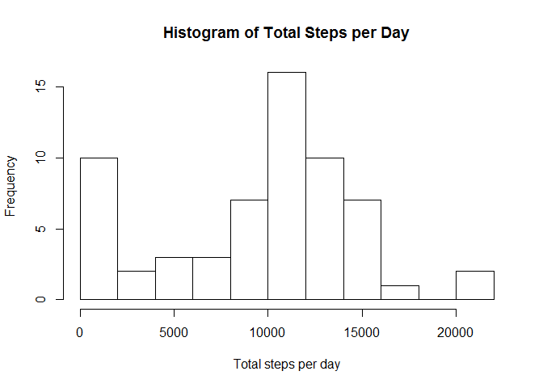
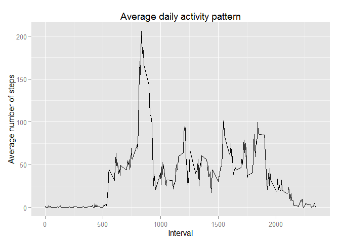
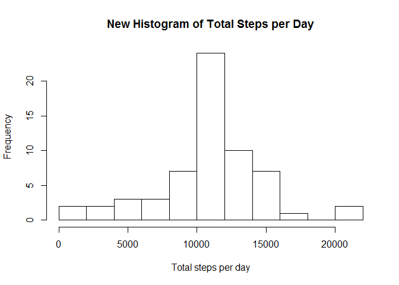
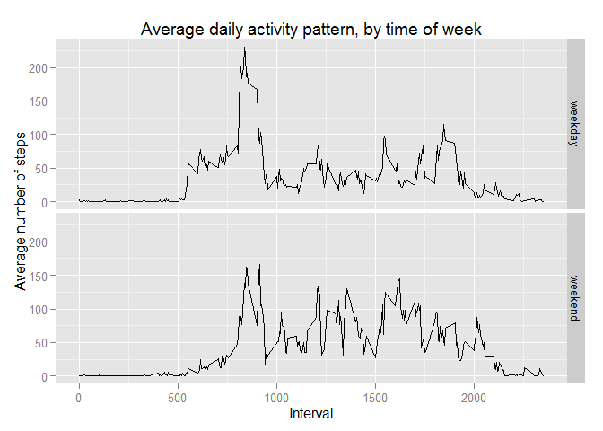

# Reproducible Research: Peer Assessment 1

This assignment involves analyzing the data from a personal activity monitoring
device. It is also an exercise in literate statistical programming using 
R Markdown. 

## Loading and preprocessing the data

Working with the assumption that the zipped data file is in the current working 
directory, we need to unzip the file and then load the data into R.


```r
unzip("activity.zip")
data <- read.csv("activity.csv")
```

## What is mean total number of steps taken per day?

Use tapply to calculate the total number of steps taken per day:


```r
total_steps_per_day <- with( data, tapply(steps, date, sum, na.rm = T) )
```

Now create a histogram of the total number of steps taken per day.


```r
hist(total_steps_per_day, breaks = 10, 
     main = "Histogram of Total Steps per Day", xlab = "Total steps per day")
```

 

Some summary statistics, including the mean and median, for the total number
of steps per day are presented below:


```r
summary(total_steps_per_day)
```

```
##    Min. 1st Qu.  Median    Mean 3rd Qu.    Max. 
##       0    6778   10400    9354   12810   21190
```

Both the histogram and summary indicate that the data was taken from a 
reasonably active individual who achieves more than 10,000 steps half of the 
days in the 2-month sample period. 

## What is the average daily activity pattern?

Before we can view this individual's average daily activity pattern, let us
first compute his/her average steps per interval and place the results in a 
data frame.


```r
avg_steps_per_interval <- aggregate(steps ~ interval, data = data, FUN = "mean")
```

Now we can plot (using the ggplot library) the required time series plot of the 
5-minute interval (x-axis) and the average number of steps taken, averaged 
across all days (y-axis).


```r
library(ggplot2)
qplot(interval, steps, data = avg_steps_per_interval, geom = "line") +
    labs(title = "Average daily activity pattern") +
    labs(x = "Interval", y = "Average number of steps" )
```

 

From this plot, we can see that the interval with the maximum average number of
steps is:


```r
avg_steps_per_interval[which.max(avg_steps_per_interval$steps), "interval"]
```

```
## [1] 835
```

with a maximum number of steps of:


```r
avg_steps_per_interval[which.max(avg_steps_per_interval$steps), "steps"]
```

```
## [1] 206.1698
```

## Imputing missing values

The total number of missing values in the data set is:


```r
num_missing_points <- sum(is.na(data$steps))
print(num_missing_points)
```

```
## [1] 2304
```

That's quite a lot considering there are only 17568 data points. This 
implies that more than 13% of the 
observations in the data set had `NA` values.

In order to "fill in" the missing values in the dataset, I have chosen to do 
the following. For each 5-minute interval with an `NA` steps value in the data
set, set the number of steps to be equal to the average for that particular 
5-minute interval, as calculated above.

Now we create a new dataset that is equal to the original dataset but with the missing data filled in.


```r
new_data <- data
rownames(avg_steps_per_interval) <- avg_steps_per_interval$interval
for (i in 1:nrow(new_data)) {
    if (is.na(new_data[i,"steps"])) {
        new_data[i,"steps"] <- avg_steps_per_interval[as.character(new_data[i,"interval"]),"steps"]
    }
}
```

Make a second histogram of the total number of steps taken each day from the new
data.

```r
new_total_steps_per_day <- with(new_data, tapply(steps, date, sum, na.rm = T) )
hist(new_total_steps_per_day, breaks = 10, 
     main = "New Histogram of Total Steps per Day", xlab = "Total steps per day")
```

 

Also calculate summary statistics, including mean and median, for the total 
number of steps taken per day from the new filled-in data.

```r
summary(new_total_steps_per_day)
```

```
##    Min. 1st Qu.  Median    Mean 3rd Qu.    Max. 
##      41    9819   10770   10770   12810   21190
```

Comparing the statistics and histogram from the new data to those from the 
original data, we observe that estimates change and filling in the missing data
leads to higher estimates.

## Are there differences in activity patterns between weekdays and weekends?

In order to investigate whether there are differences in activity patterns 
between weekdays and weekends, we first need to create a new factor variable in 
the new dataset with two levels - "weekday" and "weekend" indicating whether a 
given date is a weekday day or weekend day.


```r
for (i in 1:nrow(new_data)) {
    weekday <- weekdays( as.Date(new_data[i,"date"]) )
    if ( weekday == "Saturday" || weekday == "Sunday") {
        time_of_week <- "weekend"
    } else {
        time_of_week <- "weekday"
    }
    new_data[i,"time_of_week"] <- time_of_week
}
new_data$time_of_week <- as.factor(new_data$time_of_week)
```

Now we compute the average steps per interval averaged across all weekday days 
and weekend days, and place the results in a data frame.


```r
avg_steps_per_interval_weekday <- aggregate(steps ~ interval+time_of_week, 
                                            data = new_data, FUN = "mean")
```

Lastly, we create a panel plot containing a time series plot of the 5-minute 
interval (x-axis) and the average number of steps taken, averaged across all 
weekday days or weekend days (y-axis).


```r
qplot(interval, steps, facets = time_of_week ~ ., data = avg_steps_per_interval_weekday, geom = "line") +
    labs(title = "Average daily activity pattern, by time of week") +
    labs(x = "Interval", y = "Average number of steps" )
```

 
